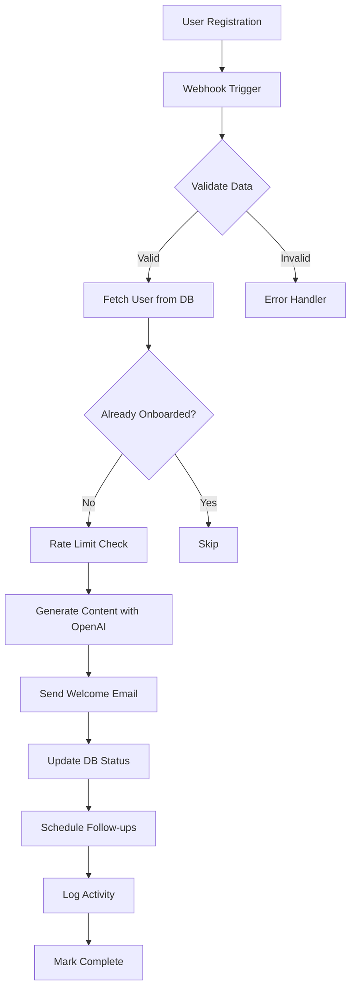

# n8n Integration für KI-Beratungsplattform

## 🚀 Übersicht

n8n ist unsere Workflow-Automatisierungs-Engine für alle wiederkehrenden Prozesse der KI-Beratungsplattform. Diese Dokumentation beschreibt die Integration und verfügbaren Workflows.

## 📋 Verfügbare Workflows

### 1. **User Onboarding** ✅
- **Trigger:** `user.registered` Webhook
- **Aktionen:** 
  - Personalisierte Welcome E-Mail (OpenAI + SendGrid)
  - Follow-up E-Mails (Tag 3, 7, 14)
  - Onboarding-Status Tracking
- **Status:** Template vorhanden

### 2. **Assessment Completion** 🔄
- **Trigger:** `assessment.completed` Webhook
- **Aktionen:**
  - KI-generierte Roadmap
  - PDF Report Generierung
  - E-Mail mit Ergebnissen
  - Berater-Benachrichtigung
- **Status:** Zu implementieren

### 3. **Payment Processing** 💳
- **Trigger:** Stripe Webhooks
- **Aktionen:**
  - Subscription Updates
  - Rechnung erstellen/versenden
  - Failed Payment Retry
  - Churn Prevention
- **Status:** Zu implementieren

### 4. **Weekly Reports** 📊
- **Trigger:** Cron (Montags 9:00)
- **Aktionen:**
  - Progress Aggregation
  - Personalisierte Insights
  - Batch E-Mail Versand
- **Status:** Zu implementieren

## 🔧 Setup-Anleitung

### Schritt 1: n8n Installation

#### Option A: Docker Compose (Empfohlen)
```bash
# Erweitere docker-compose.supabase.yml
docker-compose -f docker-compose.supabase.yml up -d
```

#### Option B: Standalone n8n
```yaml
# docker-compose.n8n.yml
version: '3.8'

services:
  n8n:
    image: n8nio/n8n:latest
    container_name: ki-beratung-n8n
    restart: unless-stopped
    ports:
      - "5678:5678"
    environment:
      - N8N_HOST=0.0.0.0
      - N8N_PORT=5678
      - N8N_PROTOCOL=http
      - NODE_ENV=production
      - WEBHOOK_URL=https://n8n.ki-beratung.de
      - N8N_ENCRYPTION_KEY=${N8N_ENCRYPTION_KEY}
      - DB_TYPE=postgresdb
      - DB_POSTGRESDB_HOST=supabase-db
      - DB_POSTGRESDB_PORT=5432
      - DB_POSTGRESDB_DATABASE=n8n
      - DB_POSTGRESDB_USER=n8n_user
      - DB_POSTGRESDB_PASSWORD=${N8N_DB_PASSWORD}
    volumes:
      - n8n-data:/home/node/.n8n
    networks:
      - ki-beratung-network

volumes:
  n8n-data:

networks:
  ki-beratung-network:
    external: true
```

### Schritt 2: Credentials Setup

Erstelle folgende Credentials in n8n:

#### 1. **PostgreSQL (Supabase)**
```json
{
  "host": "aws-0-eu-central-1.pooler.supabase.com",
  "port": 6543,
  "database": "postgres",
  "user": "postgres.YOUR-PROJECT-REF",
  "password": "YOUR-PASSWORD",
  "ssl": true
}
```

#### 2. **OpenAI**
```json
{
  "apiKey": "sk-...",
  "organizationId": "org-..."
}
```

#### 3. **SendGrid**
```json
{
  "apiKey": "SG...",
  "fromEmail": "noreply@ki-beratung.de",
  "fromName": "KI-Beratungsplattform"
}
```

#### 4. **Backend API**
```json
{
  "baseUrl": "http://backend:3001/api/v1",
  "apiToken": "YOUR-BACKEND-JWT-TOKEN"
}
```

#### 5. **Redis**
```json
{
  "host": "redis",
  "port": 6379,
  "database": 0
}
```

### Schritt 3: Workflow Import

1. **n8n Dashboard öffnen:** http://localhost:5678
2. **Workflow importieren:** Settings → Import from File
3. **Workflow-Datei:** `/workflows/user-onboarding.json`
4. **Credentials zuweisen** in jedem Node
5. **Webhook URL kopieren** für Backend

### Schritt 4: Backend Integration

#### API Endpoints erstellen:

**1. Webhook Endpoint**
```typescript
// backend/src/api/webhooks/user-registered.ts
import { Router } from 'express'
import axios from 'axios'

const router = Router()

router.post('/webhooks/user-registered', async (req, res) => {
  const { userId, email, name } = req.body
  
  try {
    // Trigger n8n Webhook
    await axios.post(process.env.N8N_WEBHOOK_URL + '/user-registered', {
      event: 'user.registered',
      userId,
      email,
      name,
      timestamp: new Date().toISOString()
    })
    
    res.json({ success: true })
  } catch (error) {
    console.error('n8n webhook failed:', error)
    res.status(500).json({ error: 'Webhook failed' })
  }
})
```

**2. Follow-up Scheduling**
```typescript
// backend/src/api/workflows/schedule-followup.ts
router.post('/workflows/schedule-followup', authenticate, async (req, res) => {
  const { userId, followupType, scheduleFor, workflowId } = req.body
  
  // Store in database or job queue
  await prisma.scheduledWorkflow.create({
    data: {
      userId,
      workflowId,
      type: followupType,
      scheduledFor: new Date(scheduleFor),
      status: 'pending'
    }
  })
  
  res.json({ scheduled: true })
})
```

### Schritt 5: Datenbank Erweiterungen

```sql
-- Migration für n8n Features
ALTER TABLE users ADD COLUMN IF NOT EXISTS onboarding_email_sent BOOLEAN DEFAULT FALSE;
ALTER TABLE users ADD COLUMN IF NOT EXISTS onboarding_email_sent_at TIMESTAMP;
ALTER TABLE users ADD COLUMN IF NOT EXISTS onboarding_completed_at TIMESTAMP;

-- Tabelle für geplante Workflows
CREATE TABLE scheduled_workflows (
  id UUID PRIMARY KEY DEFAULT gen_random_uuid(),
  user_id UUID REFERENCES users(id),
  workflow_id VARCHAR(255) NOT NULL,
  type VARCHAR(100),
  scheduled_for TIMESTAMP NOT NULL,
  executed_at TIMESTAMP,
  status VARCHAR(50) DEFAULT 'pending',
  created_at TIMESTAMP DEFAULT CURRENT_TIMESTAMP
);

CREATE INDEX idx_scheduled_workflows_status ON scheduled_workflows(status, scheduled_for);
```

## 📊 Workflow-Dokumentation

### User Onboarding Flow



### Error Handling

Alle Workflows implementieren:
- **Retry Logic:** 3 Versuche mit Exponential Backoff
- **Error Notifications:** Slack/Email bei kritischen Fehlern
- **Fallback Paths:** Alternative Aktionen bei Fehler
- **Logging:** Strukturierte Logs für Debugging

## 🔐 Security

### Webhook Security
```typescript
// Webhook Signatur Validierung
const crypto = require('crypto')

function validateWebhookSignature(payload, signature) {
  const hash = crypto
    .createHmac('sha256', process.env.N8N_WEBHOOK_SECRET)
    .update(JSON.stringify(payload))
    .digest('hex')
  
  return hash === signature
}
```

### Rate Limiting
- OpenAI: 60 Requests/Minute
- SendGrid: 100 Emails/Minute
- Webhooks: 1000/Hour per User

## 📈 Monitoring

### Metriken
- Workflow Execution Time
- Success/Failure Rate
- API Usage (OpenAI Tokens)
- Email Delivery Rate

### Alerts
- Workflow Failures > 10%
- API Rate Limits erreicht
- Database Connection Issues
- Queue Backlog > 1000

## 🚀 Deployment

### Production Setup
1. **n8n auf separatem Server** (2 CPU, 4GB RAM minimum)
2. **SSL/TLS für Webhooks** (Let's Encrypt)
3. **Backup der Workflows** (täglich)
4. **Environment Variables** über Secrets Manager

### Environment Variables
```env
# n8n Configuration
N8N_ENCRYPTION_KEY=your-32-char-encryption-key
N8N_WEBHOOK_SECRET=your-webhook-secret
N8N_DB_PASSWORD=secure-password

# External Services
OPENAI_API_KEY=sk-...
SENDGRID_API_KEY=SG...
STRIPE_WEBHOOK_SECRET=whsec_...

# URLs
N8N_WEBHOOK_URL=https://n8n.ki-beratung.de/webhook
BACKEND_API_URL=https://api.ki-beratung.de
```

## 📚 Weitere Workflows (Geplant)

### Assessment Completion
- Trigger: Assessment fertig
- OpenAI: Roadmap Generation
- PDF: Report Creation
- Email: Ergebnis-Versand
- Slack: Berater-Notification

### Payment Processing
- Trigger: Stripe Events
- Actions: Status Updates
- Retry: Failed Payments
- Email: Receipts

### Analytics & Reporting
- Daily: Usage Stats
- Weekly: Progress Reports
- Monthly: Business Metrics

## 🆘 Troubleshooting

### Häufige Probleme

**1. Webhook nicht erreichbar**
- Prüfe Docker Network
- Firewall Rules
- n8n Webhook URL

**2. Database Connection Failed**
- Connection Pooling aktiv?
- SSL Required?
- Credentials korrekt?

**3. OpenAI Rate Limits**
- Redis Cache funktioniert?
- Rate Limiter aktiv?
- Backup Content vorhanden?

### Debug Mode
```bash
# n8n im Debug Mode starten
docker-compose exec n8n n8n start --tunnel
```

---

**Erstellt:** 2025-01-23  
**Maintainer:** CEO Agent  
**Version:** 1.0