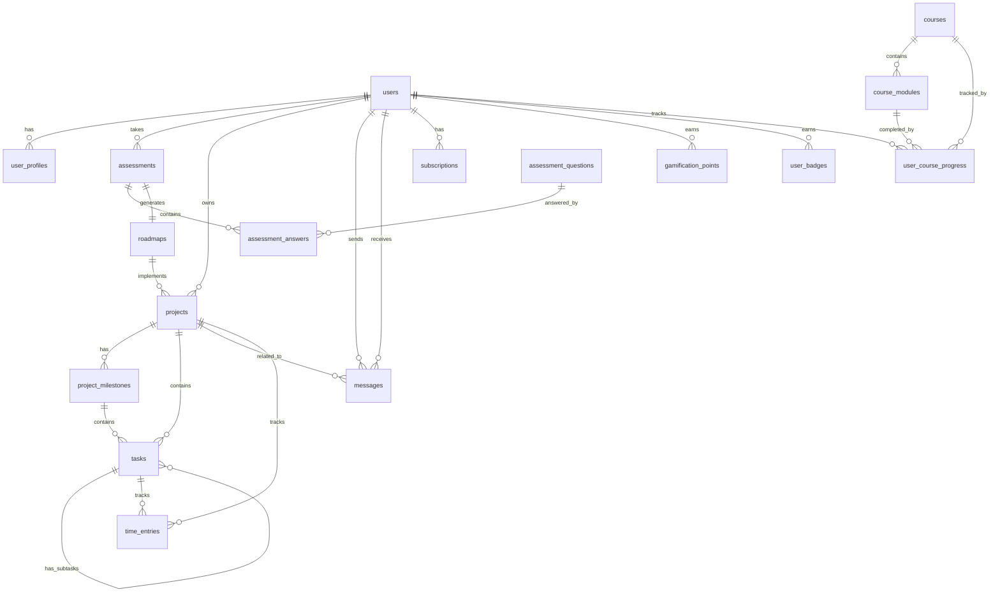

# Entity Relationship Diagram

## Database Overview
PostgreSQL database for KI-Beratung Platform with comprehensive user management, assessment tracking, project management, and learning systems.

## Visual ERD

## Key Relationships

### User System
- One user can have one profile
- One user can have multiple assessments
- One user can own multiple projects
- One user can be assigned as consultant to multiple projects

### Assessment System
- One assessment belongs to one user
- One assessment can have multiple answers
- One assessment generates one roadmap
- Assessment questions are reusable across assessments

### Project System
- One project belongs to one user
- One project can implement one roadmap
- One project has multiple milestones
- One milestone has multiple tasks
- Tasks can have subtasks (self-referencing)

### Learning System
- One course has multiple modules
- Users track progress per course and module
- Multiple users can take the same course

### Communication
- Messages are between two users
- Messages can be related to a project
- Real-time chat via Socket.io integration

### Gamification
- Users earn points for various actions
- Users can earn multiple badges
- Points and badges are tracked separately

## Database Design Principles

1. **Normalization**: Tables are normalized to 3NF to reduce redundancy
2. **UUIDs**: Using UUIDs for primary keys for better distribution
3. **Soft Deletes**: Status fields instead of hard deletes for data retention
4. **Audit Trail**: created_at and updated_at on all tables
5. **JSONB Usage**: For flexible schema fields (preferences, metadata)
6. **Indexing**: Strategic indexes on foreign keys and frequently queried fields
7. **Constraints**: Proper foreign key constraints with CASCADE options
8. **Enums**: Using string enums for better readability and flexibility